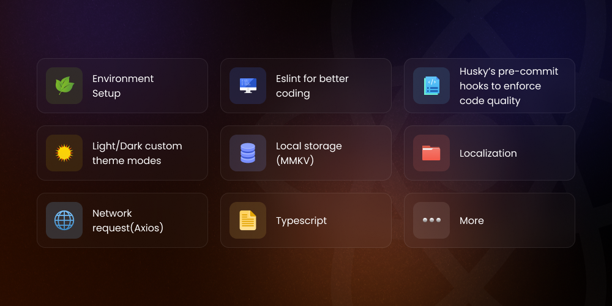

# Features

The boilerplate comes loaded with several features. Here's a breakdown of each one.

 

 

## Built in implemented features.

- [x] Attractive code architecture.
- [x] Context API.
- [x] Environment Setup
- [x] Eslint for better code linting
- [x] Husky improves your commits and more.
- [x] Light/Dark custom theme modes.
- [x] Local storage(MMKV).
- [x] Localization.
- [x] Navigation.
- [x] Network request (API implementation).
- [x] Supported for responsive UI.
- [x] Typescript.

## Advantages

- Attractive Code Architecture
  Our boilerplate comes with a clean and organized code structure that enhances readability and maintainability.
- Advanced State Management with Redux and Context API
  Harness the power of both Redux and React's Context API for efficient state management. Redux with Thunk middleware handles complex state logic, while the Context API facilitates easy sharing of data between components, especially for app theme and localization management.
- Environment Setup
  Hassle-free setup with detailed instructions, ensuring a smooth onboarding process for developers.
- Eslint for Better Code Linting
  Catch and fix issues early with Eslint integration, promoting consistent and error-free code.
- Husky Improves Your Commits and More
  Benefit from Husky's pre-commit hooks to enforce code quality and ensure that only well-formatted code makes it into your repository.
- Light/Dark Custom Theme Modes
  Enjoy the flexibility of light and dark theme modes with easy customization options to suit your app's design. This feature is seamlessly managed through the Context API.
- Local Storage (MMKV)
  Efficient and reliable local storage using MMKV, optimizing data persistence in your React Native application.
- Localization
  Easily add multilingual support to your app with our localization feature, utilizing the power of the Context API for seamless language switching and management.
- Navigation
  Seamless navigation setup with React Navigation, providing a smooth and intuitive user experience.
- Network Request (API Implementation)
  Simplified API integration for making network requests, saving you time and effort in implementing backend communication.
- Supported for Responsive UI
  Build responsive user interfaces that adapt to various screen sizes, providing a consistent user experience across devices.
- TypeScript
  Harness the benefits of TypeScript for static typing, catching errors at compile-time, and improving code quality. The combination of TypeScript with Redux and Context API ensures a robust and type-safe application architecture.
