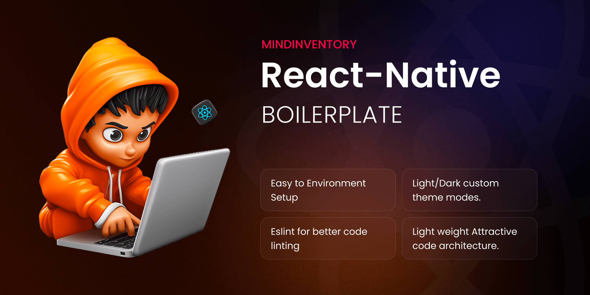

# Introduction

The Boilerplate contains all the basic packages, common components and, prebuilt code architecture. It will save developer's project setup time.
 

 
 

This repository serves as a boilerplate for React Native projects, providing a solid foundation to kickstart your development process. It includes a collection of scripts to generate images and icons, making it easier to customize your app's visual assets.

## What is a Boilerplate?

A boilerplate provides a pre-configured foundation for your project. In the context of React Native, this boilerplate offers a pre-built code structure, essential components, and scripts to automate tasks like image and icon generation. Essentially, it eliminates the need to set up a new project from scratch, saving you valuable development time.

## Benefits of Using This Boilerplate

- **Faster Project Setup:** Hit the ground running with a pre-defined code structure and common components.
- **Improved Code Quality:** Leverage features like Context API, Redux, ESLint, and Husky to maintain clean and efficient code.
- **Streamlined Development:** Automate repetitive tasks like image and icon generation with built-in scripts.
