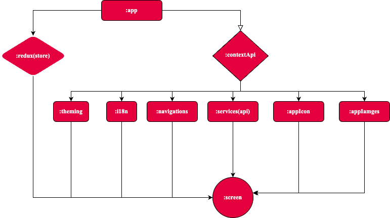

# Modules Diagram

Building Modular React Native Apps: A Look at Dependency Management

When it comes to building complex React Native applications, keeping your code organized and maintainable is crucial. Enter modularization! By dividing your project into smaller, independent units called modules, you can achieve a cleaner structure and simplify collaboration within your development team.

 

 

### Dependency Management in Action:

The provided graph beautifully illustrates the concept of dependency management in a React Native boilerplate. Here's a breakdown of the key points:

- #### Modularization by Functionality:

  At its core, the boilerplate promotes dividing your app into modules based on specific functionalities. This allows you to focus on individual areas without getting bogged down in the bigger picture.

- #### Dependency Hierarchy:
  The graph depicts the dependency relationships between modules. This ensures that modules are built in the correct order and prevents errors due to missing dependencies.

### Let's dive deeper into the specific modules and their dependencies:

- #### `:app`

  This is the heart of your application. It depends on the **:context** module for app-wide data management like themes, navigation, and potentially user data. Through dynamic features, it can indirectly depend on the **:store** for global state management.

- #### `:context`

  This module acts as a central hub for application-wide data. It relies on other modules like **:theming**, **:i18n**, **:navigation**, **:services**, and even the **:app** module itself to function properly.

- #### `:store`

  This module houses the Redux store, the backbone of global state management in your React Native application. It also integrates Redux Persist for state persistence, ensuring your app remembers its state even after it's closed.

 
By adopting a modular approach with a well-defined dependency structure, as exemplified by the provided boilerplate, you'll be well on your way to building robust, maintainable, and scalable React Native applications.
