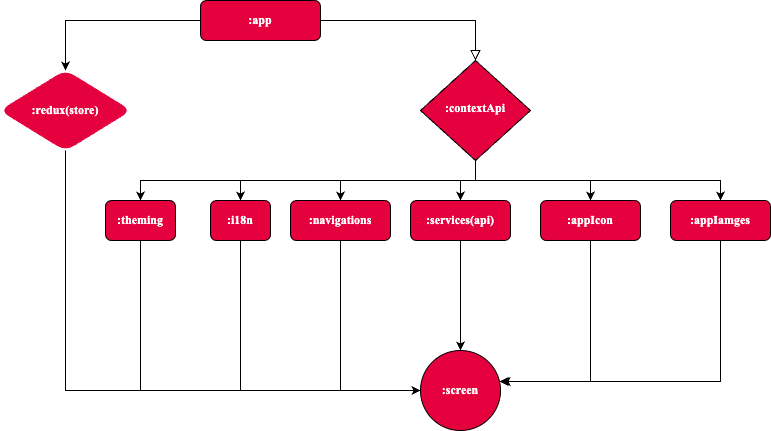

<!-- @format -->

# React Native Boilerplate!🚀

[](<[https://www.npmjs.org/package/@mindinventory/react-native-boilerplate](https://www.npmjs.com/package/@mindinventory/react-native-boilerplate)>)


The Boilerplate contains all the basic packages, common components and, prebuilt code architecture. It will save developer's project setup time.

## Introduction

This repository serves as a boilerplate for React Native projects, providing a solid foundation to kickstart your development process. It includes a collection of scripts to generate images and icons, making it easier to customize your app's visual assets.

Create a new project using the boilerplate :

```
npx react-native init APP_NAME --template @mindinventory/react-native-boilerplate
```

<a href="https://www.mindinventory.com/?utm_source=gthb&utm_medium=repo&utm_campaign=react-native-boilerplate" target="__blank" ></a>

## Features

<a href="https://www.mindinventory.com/?utm_source=gthb&utm_medium=repo&utm_campaign=react-native-boilerplate" target="__blank" ><p>Built in implemented features.</p></a>

- [x] Attractive code architecture.
- [x] Context API.
- [x] Environment Setup
- [x] Eslint for better code linting
- [x] Husky improves your commits and more.
- [x] Light/Dark custom theme modes.
- [x] Local storage(MMKV).
- [x] Localization.
- [x] Navigation.
- [x] Network request (API implementation).
- [x] Supported for responsive UI.
- [x] Typescript.

# Using Boilerplate

## Advantages

1. Attractive Code Architecture
   Our boilerplate comes with a clean and organized code structure that enhances readability and maintainability.
2. Advanced State Management with Redux and Context API
   Harness the power of both Redux and React's Context API for efficient state management. Redux with Thunk middleware handles complex state logic, while the Context API facilitates easy sharing of data between components, especially for app theme and localization management.
3. Environment Setup
   Hassle-free setup with detailed instructions, ensuring a smooth onboarding process for developers.
4. Eslint for Better Code Linting
   Catch and fix issues early with Eslint integration, promoting consistent and error-free code.
5. Husky Improves Your Commits and More
   Benefit from Husky's pre-commit hooks to enforce code quality and ensure that only well-formatted code makes it into your repository.
6. Light/Dark Custom Theme Modes
   Enjoy the flexibility of light and dark theme modes with easy customization options to suit your app's design. This feature is seamlessly managed through the Context API.
7. Local Storage (MMKV)
   Efficient and reliable local storage using MMKV, optimizing data persistence in your React Native application.
8. Localization
   Easily add multilingual support to your app with our localization feature, utilizing the power of the Context API for seamless language switching and management.
9. Navigation
   Seamless navigation setup with React Navigation, providing a smooth and intuitive user experience.
10. Network Request (API Implementation)
    Simplified API integration for making network requests, saving you time and effort in implementing backend communication.
11. Supported for Responsive UI
    Build responsive user interfaces that adapt to various screen sizes, providing a consistent user experience across devices.
12. TypeScript
    Harness the benefits of TypeScript for static typing, catching errors at compile-time, and improving code quality. The combination of TypeScript with Redux and Context API ensures a robust and type-safe application architecture.

## Code linting

This React Native boilerplate utilizes ESLint, a popular linting tool, to enforce consistent and high-quality code across your project. ESLint helps identify and fix common code issues, ensuring your codebase adheres to best practices and coding standards.

The ESLint configuration in this boilerplate includes the following features and plugins:

- `@commitlint/cli`: Enforces conventional commit messages.
- `@commitlint/config-conventional`: Provides commit message linting rules following conventional commit format.
- `eslint-plugin-import`: Provides rules for linting ES6 import/export syntax.
- `eslint-plugin-import-order-autofix`: Sorts import statements automatically.
- `eslint-plugin-no-inline-styles`: Detects and discourages the use of inline styles in React Native.
- `eslint-plugin-prettier`: Integrates Prettier code formatting rules into ESLint.
- `eslint-plugin-react-hooks`: Enforces rules for React Hooks.
- `eslint-plugin-react-native`: Provides rules specific to React Native development.
- `eslint-plugin-sort-keys-fix`: Sorts object keys in alphabetical order.

configuration of this lint is added in `.eslintrc.js` file.

## Tech Stack

| Library                   | Category             | Version | Description                                    |
| ------------------------- | -------------------- | ------- | ---------------------------------------------- |
| React Native              | Mobile Framework     | v0.73   | The best cross-platform mobile framework       |
| React                     | UI Framework         | v18     | The most popular UI framework in the world     |
| TypeScript                | Language             | v5      | Static typechecking                            |
| React Navigation          | Navigation           | v6      | Performant and consistent navigation framework |
| React Native Localization | Internationalization | v3      | i18n support (including RTL!)                  |
| Redux                     | State Management     | v5      | Observable state tree                          |
| Redux-toolkit             | Redux integration    | v2      | New redux library with some function helpers   |
| RN Reanimated             | Animations           | v3      | Beautiful and performant animations            |
| MMKV                      | Persistence          | v2      | State persistence                              |
| axios                     | REST client          | v1      | Communicate with back-end                      |
| Hermes                    | JS engine            |         | Fine-tuned JS engine for RN                    |

## Folder Structure

The project structure follows a modular approach to organize your codebase in a scalable manner. Here's an overview of the key folders:

```
├── blueprints
│ ├── Text
│ ├── Image
│ └── Indicator
│ └── Button
│ └── TextInput
│ └── ...
```

- **blueprints**: Contains the app elements that Customize as per app development required.

  - **Text**: Text element(typography) for app consist presets of all font family and font-size that we have to use in app.
    For Example:

    ```js
    import { Text } from '@app/blueprints';

    <Text preset="h1">{contents('newsList', 'breakingNews')}</Text>;
    ```

  - **Image**: React Native's Image component handles image caching like browsers for the most part using `react-native-fast-image` library.
    For Example:

    ```js
    import { Image } from '@app/blueprints';

    <Image source={sourcePath} {...props} />;
    ```

  - **Indicator**: Show loader in app with customize way. use it form context of app.
    For Example:

    ```js
    const { loader } = useAppContext();

    //to show Indicator
    loader.current.show();
    //to hide Indicator
    loader.current.hide();
    //get Indicator status
    loader.current.isLoading;
    ```

  - **Button**: Animated scalability adds an extra layer of interactivity to your buttons with TouchableOpacity
    For Example:

    ```js
    import { Button } from '@app/blueprints';

    <Button
      buttonContainerStyle={{ marginTop: scaleHeight(15) }}
      title="Go back"
      {...TouchableOpacityProps}
    />;
    ```

  - **TextInput**: Material UI all input variant added.
    For Example:

    ```js
    import { Input } from '@app/blueprints';

    <Input variant="standard" {...TextInputProps} />;
    ```

```
├── src
│ ├── assets
│ ├── components
│ ├── constants
│ ├── context
│ ├── hooks
│ ├── i18n
│ ├── navigation
│ ├── screens
│ ├── services
│ ├── store
│ ├── utils
└── MainApp.tsx
```

- **src**: Contains the main source code of your application.

  - **assets**: Stores static assets such as images, fonts, and icons.
  - **components**: Reusable UI components.
  - **constants**: App constants.
  - **context**: App context to manage app styles, theme, localization, storage, navigation, iconFactory and imageFactory.
  - **i18n**: Localization files for i18next.
  - **navigation**: Navigation setup and configuration.
  - **screens**: Individual screens/pages of your application.
  - **services**: Handles API-related logic and communication.
  - **store**: Redux store, actions, reducers, selectors and state observers.
  - **utils**: Utility functions and helpers.

```
├── src
│ ├── services
│ ├──├──commercial
│ ├──├──├──response
│ ├──├──├──├── getLoginResponseAdapter.ts
│ ├──├──├──├── getNesListResponseAdapter.ts
│ ├──├──├──├── ...
│ ├── dtos
│ ├──├── LoginResponseDTO.ts
│ ├──├── NewsListResponseDTO.ts
│ ├──├── ...
│ ├── models
│ ├──├── login.ts
│ ├──├── news.ts
│ ├──├── ...
│ ├── apiHandler
│ ├── apiServices
│ ├── apiServices.type
│ ├── apiServicesEndPoints
│ ├── ...
└── ...
```

```
├── src
│ ├── screens
│ ├──├── newsList
│ ├──├──├── newsList.style.ts
│ ├──├──├── newListScreen.tsx
│ ├──├──├── useNewsList.ts
│ ├──├── login
│ ├──├──├── login.style.ts
│ ├──├──├── loginScreen.tsx
│ ├──├──├── useLogin.ts
│ ├── ...
└── ...
```

```
├── src
│ ├── assets
│ ├──├── fonts (all fonts in this)
│ ├──├── icons (app icons)
│ ├──├── svgIcons (svg app icons)
│ ├──├── images (local images used in app)
│ ├──├── ...
│ ├── components
│ ├──├── ... app reusable components
│ ├──├── index (export all in this)
│ ├──├── ...
│ ├── context
│ ├──├── storage (app local storage)
│ ├──├── ...
│ ├── i18n
│ ├──├── locales
│ ├──├──├── en.json
│ ├──├──├── ...
│ ├──├── index.ts
│ ├──├── ...
│ ├── utils
│ ├──├── color (include themes color of app)
│ ├──├── dimensions (for responsive UI helper fucntions)
│ ├──├── helper (include app helper function)
│ ├──├── ...
└── ...
```

```
├── src
│ ├── navigation
│ ├──├── appNavigation  (stack of all screens in this)
│ ├──├── appNavigation.type (include all screen names and params in this)
│ ├──├── ...
└── ...
```

## Modules

<p align="center">
 
</p>

Modules are collection of source files and build settings that allow you to divide a project into discrete units of functionality. In this case apart from dividing by functionality/responsibility, existing the following dependence between them:

The above graph shows the app modularization:

- `:app` depends on `:context` and indirectly depends on `:store` by dynamic-features.
- `:context` modules depends on `:theming`, `:i18n`, `:navigation` `:services` and `:app`.
- `:store` redux store for global state management with redux persist state persistence.

## Configuration

The boilerplate comes with a few configuration files that you can customize to fit your project's needs:

- **.env**: Environment-specific configuration (e.g., API URLs, keys).
- **.husky**: Husky improves your commits and more.
- **.prettierrc**: Configuration for Prettier code formatting.
- **.eslintrc**: Configuration for ESLint code linting.
- **tsconfig.json**: TypeScript compiler configuration.

# Scripts

### React Native Screen Generator

**Automation Script:** This Node.js script streamlines React Native screen module creation by generating a folder structure with key files based on a provided folder name.

**Features:**

- Includes a custom hook for state and styling management.
- Appends an export statement to the screens index file for easy project-wide accessibility.

**Efficiency Boost:** Standardizing screen module creation, the script promotes development efficiency in React Native projects.

#### Usage

**Run the Script:**

```
  yarn screens screeName
```

# Icons Script

This Node.js script generates a TypeScript enum for React Native icons based on image files within the "**../src/assets/icons**" directory. It filters and organizes icon filenames, ensuring compatibility with multiple resolutions, and exports them within the generated enum.

##### Example:

Suppose the "../src/assets/icons" directory contains icon files like "**home@2x.png**" and "**home@3x.png**." Running the script creates a TypeScript enum (Icons) in "../src/assets/icons/index.ts," providing organized references to these icons:

```
yarn icons
```

```typescript
export enum Icons {
  HOME_ICONS = require('./home.png'),
  // Other icons...
}
```

# Images Script

This Node.js script creates a TypeScript enum for React Native images, sourcing filenames from the "**../src/assets/images**" directory. It filters and organizes image files, accommodating different resolutions, and exports them as enum properties for easy referencing.

##### Example:

Assuming the "../src/assets/images" directory includes files like **"background@2x.jpg"** and "logo.png," running the script generates a TypeScript enum (Images) in "../src/assets/images/index.ts," providing organized references to these images:

```
yarn images
```

```typescript
export enum Images {
  BACKGROUND_IMAGE = require('./background.jpg'),
  LOGO_IMAGE = require('./logo.png'),
  // Other images...
}
```

# Refresh.sh

This Bash script performs a cleanup and dependency reinstall for a React Native project. It removes various generated and dependency-related files, clears the node_modules directory, and then reinstalls dependencies using yarn. Additionally, it runs bundle and pod install commands for iOS.

```
yarn refresh
```

# SvgIcons Script

This TypeScript script generates a module for managing SVG icons in a React Native project. It extracts SVG filenames from the "../src/assets/svgIcons" directory, imports them as React components, and creates an enum for easy referencing. Additionally, it provides a mapper object for dynamically accessing SVG icons.

**Note:** Ensure your project includes a suitable React SVG library for rendering these components.

##### Example:

Run this script to create a TypeScript module managing SVG icons in your React Native project:

```
yarn svgs
```

# Responsive UI Helpers

This set of helper functions provides a convenient way to create responsive user interfaces in your React Native applications. It helps in scaling and sizing UI elements based on the device's screen dimensions.

## Functions

The following functions are available in this helper module:

- `scaleWidth(val: number): number` - Scales a value proportionally based on the device's screen width and the predefined design width.
- `scaleHeight(val: number): number` - Scales a value proportionally based on the device's screen height and the predefined design height.
- `moderateScale(size: number, factor = 1): number` - Scales a size value using a factor to provide a moderate scaling effect.
- `scaledSize(size: number): number` - Scales a size value proportionally based on the overall screen scale.
- `screenWidth: number` - The width of the device's screen.
- `screenHeight: number` - The height of the device's screen.

## Usage

To utilize these functions for creating a responsive UI, follow these steps:

1. Import the required functions and variables from the helper module:

   ```javascript
   import {
     scaleWidth,
     scaleHeight,
     moderateScale,
     scaledSize,
     screenWidth,
     screenHeight,
   } from '@src/utils';
   ```

2. Use the functions in your styles or component logic to achieve responsive sizing:

   ```javascript
   const styles = StyleSheet.create({
     container: {
       width: scaleWidth(300),
       height: scaleHeight(200),
       marginVertical: moderateScale(10),
       fontSize: scaledSize(16),
     },
   });
   ```

   In this example, the width and height of the container will be scaled proportionally based on the device's screen width and height. The `moderateScale` function is used to provide a moderate scaling effect to the margin, and the `scaledSize` function is used to scale the font size.

3. Adjust the predefined design width and height if needed:

   ```javascript
   export const designWidth = 375;
   export const designHeight = 812;
   ```

   Modify these values according to your design specifications to ensure accurate scaling.

## Notes

- The `scaleWidth` and `scaleHeight` functions are useful for scaling dimensions, such as width, height, padding, or margin values.
- The `moderateScale` function can be used to achieve a more subtle scaling effect by providing a factor that controls the degree of scaling.
- The `scaledSize` function is handy for scaling font sizes or any other numerical values that need to adapt to different screen sizes.

Feel free to customize and extend these functions as per your project requirements to achieve the desired responsive behavior.

## Customize the visual assets

This boilerplate provides a convenient set of scripts to generate images and icons. You can find these scripts in the `scripts` directory. Follow the instructions below to generate your assets:

- **Generating Images:**

  1. Place your source images in the `src/assets/images` directory.
  2. Run the following command to automatically import the images into the assets/images/index.ts file:

     ```bash
     npm run images
     ```

  3. Get your images in app from components
     For example:

     ```javascript
     import { AppImage, Images } from '@src/components';
     ```

     use it in component as

     get local static Images from same assets

     ```javascript
     import { Images } from '@src/assets';
     ```

     For Placing static image from local assets

     ```html
     <AppImage source="{Images.PLACEHOLDER_IMAGE}" style="{styles.newsImage}" />
     ```

     To get from url or any base64

     ```html
     <AppImage source={"url || any"} style={styles.newsImage} />
     ```

- **Generating Icons:**

  1. Place your source icon image in the `src/assets/icons` directory.
  2. Run the following command to automatically import the icons into the assets/icons/index.ts file:

     ```bash
     npm run icons
     ```

  3. Get your icon in app from components
     For example:

     ```javascript
     import { Icon, SvgIcon } from '@src/components';
     ```

     get local static Icons and SVGIcons from same assets

     ```javascript
     import { Icons, SVGIcons } from '@src/assets';
     ```

     use it in component as

     ```html
     <Icon icon="{Icons.DEBUG_ICONS}" style="{styles.debugIcon}" />
     ```

     ```html
     <SvgIcon
       pathFill="{color.primaryColor}"
       icon="{SVGIcons.SETTING}"
       {...scaled(25)} />
     ```

- **Linking fonts:**
- [React-Native-Asset](https://github.com/unimonkiez/react-native-asset)

  1. Place your fonts in the `src/assets/fonts` directory.
  2. Run the following command to automatically link on native side.

     ```bash
     npx react-native-asset
     ```

  3. For linking of custom that not in google fonts required extra steps in iOS.

  - add those fonts first in fontBook app then use that name used given in fontBook.

## Environment Setup

This boilerplate uses the `react-native-config` library for environment variable setup. It allows you to define environment-specific variables in `.env` files and access them in your code.

1. Create `.env` files:

   - `.env.development` for development environment variables
   - `.env.staging` for staging environment variables
   - `.env.production` for production environment variables

   Note: You can create additional `.env` files for other environments as needed.

2. Define environment-specific variables in the `.env` files:

   ```env
   API_BASE_URL=https://api.example.com
   API_KEY=your-api-key
   ```

   Customize the variables based on your project's requirements.

3. Access environment variables in your code:
   Declare env keys in `constants/config` file

   ```typescript
   export type ConfigTypes = {
     ENV: string;
     API_URL: string;
   };
   ```

## Services(API) handling

Config your api in `src/services/apiHandler.ts` in this file set your all api handling request `get | post | put | delete` or any methods in it. Set your api base url in axios instances. Handle response status as per required.

- **Api Mapper with DTOs:**
  API Mapper with DTOs is a utility that simplifies the process of making API requests and mapping the response data to Data Transfer Objects (DTOs) in a React Native application.
- **Usage:**

Declare

1. Create DTOs
   Create the DTOs (Data Transfer Objects) that represent the structure of the API response data. Each DTO should define the properties that match the response data fields.

   For example, let's create a UserDTO to represent user data:

   ```typescript
   export interface UserResponseDTO {
     page: number;
     per_page: number;
     total: number;
     total_pages: number;
     data: DatumDTO[];
     support: SupportDTO;
   }
   export interface DatumDTO {
     id: number;
     email: string;
     first_name: string;
     last_name: string;
     avatar: string;
   }
   export interface SupportDTO {
     url: string;
     text: string;
   }
   ```

2. Define API Endpoints
   API endpoints in your React Native application in `src/services/appServicesEndPoints.ts`. These endpoints should include the URL, HTTP method, and any required headers or parameters.
3. Call api as per serviceAdapter methods in `src/services/appServices.ts`.
   Create a function in class:

   ```typescript
   getNews = async (): Promise<NewsResult[]> => {
     return new Promise((resolve, reject) => {
       serviceAdapter<NewsResponseDTO, undefined>(
         API_METHODS.GET,
         ServicesEndPoints.NEWS
       )
         .then(res => {
           resolve(new getNewsListResponseAdapter().service(res));
         })
         .catch(error => {
           reject(error);
         });
     });
   };
   ```

4. Map your response in `src/services/commercial/adapters/response` with your api name like for newList `getNewsListResponseAdapter.ts`
5. Call your api mapper DTOs to in services as show in 3rd point.

## Start the development server

```bash
npm start
```

## Customization

Feel free to customize the React Native Boilerplate to fit your project's specific needs. Here are some areas you might consider modifying:

- **App Configuration:** Update the app's configuration files, such as `app.json`, `babel.config.js` and `metro.config.js`, to match your desired settings.
- **Directory Structure:** Adjust the project's directory structure to better organize your codebase.
- **Styling and Theming:** Modify the existing styles and themes or add your own to create a unique visual identity for your app.
- **Additional Scripts:** Extend the `scripts` directory with your own scripts to automate repetitive tasks specific to your project.

## Contribution

Contributions to this boilerplate are welcome! If you encounter any issues or have suggestions for improvements, please feel free to open an issue or submit a pull request on the repository.

# LICENSE

react-native-boilerplate is [MIT-licensed](https://github.com/Mindinventory/react-native-boilerplate/blob/master/LICENSE).

# Let us know

If you use our open-source libraries in your project, please make sure to credit us and Give a star to www.mindinventory.com

<p><h4>Please feel free to use this component and Let us know if you are interested to building Apps or Designing Products.</h4>
<a href="https://www.mindinventory.com/contact-us.php?utm_source=gthb&utm_medium=repo&utm_campaign=circular-cards-stack-view" target="__blank">

</a>
